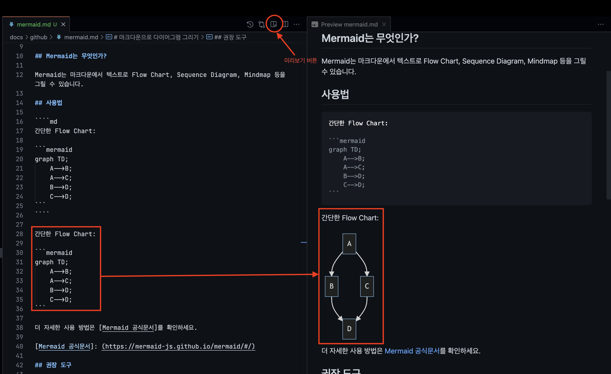

# 마크다운으로 다이어그램 그리기

## Mermaid는 무엇인가?

Mermaid는 마크다운에서 텍스트로 Flow Chart, Sequence Diagram, Mindmap 등을 그릴 수 있습니다.

## 사용법

````md
간단한 Flow Chart:


````

간단한 Flow Chart:


더 자세한 사용 방법은 [Mermaid 공식문서]를 확인하세요.

[Mermaid 공식문서]: (https://mermaid-js.github.io/mermaid/#/)

## 권장 도구

Mermaid는 그냥 작성하면 실수할 수 있기 때문에 즉각적으로 확인해볼 수 있는 도구와 함께하는 것이 좋습니다.

- Visual Studio Code
- [Mermaid Extention](https://marketplace.visualstudio.com/items?itemName=bierner.markdown-mermaid)

Visual Studio Code에서 Mermaid 익스텐션을 설치하면 Preview를 통해 즉각적인 확인이 가능합니다.



마크다운에서 작성하고 미리보기 버튼을 클릭하면 즉각 확인 가능합니다.
